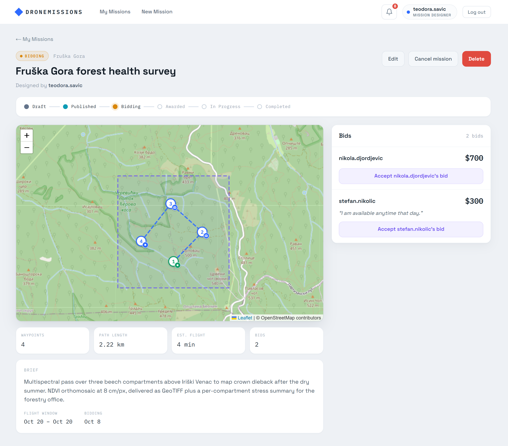
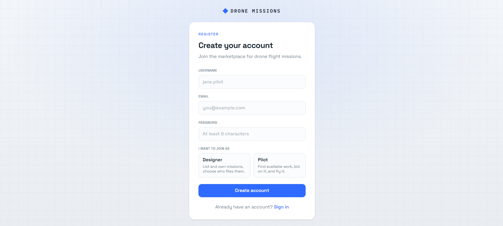
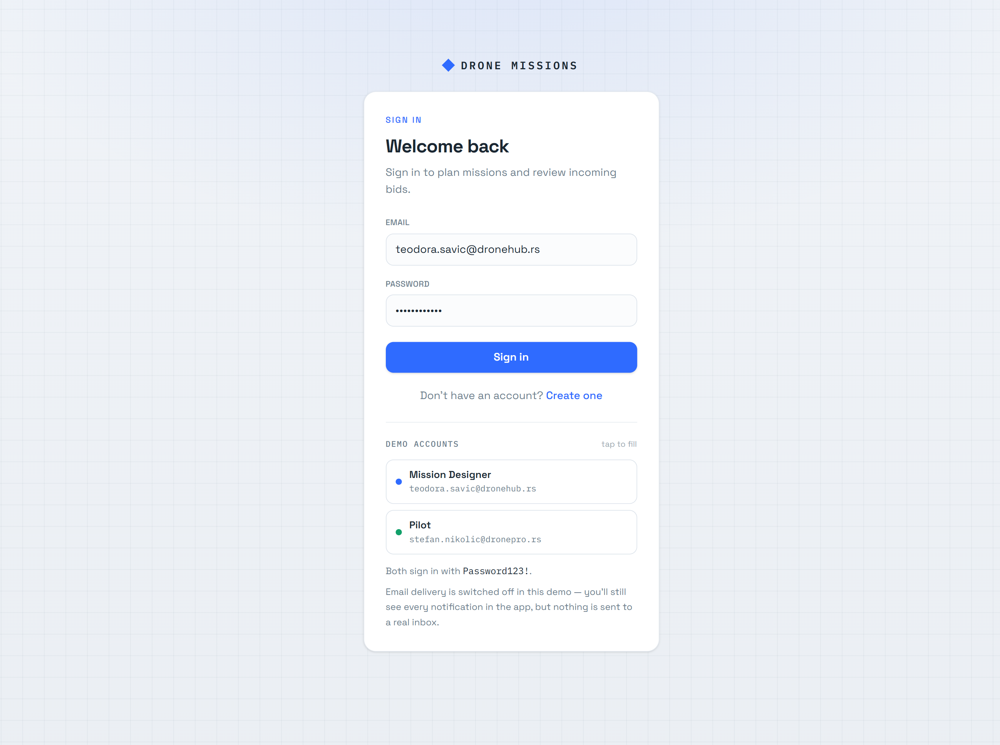
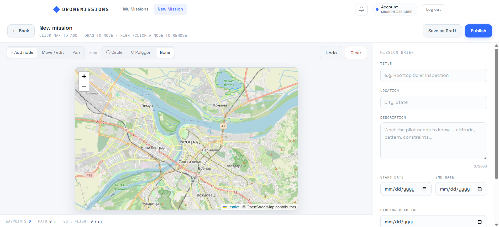
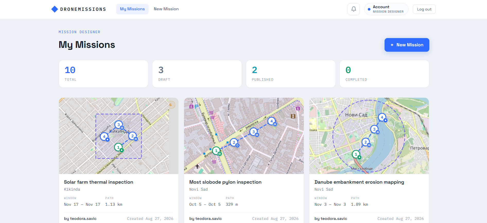
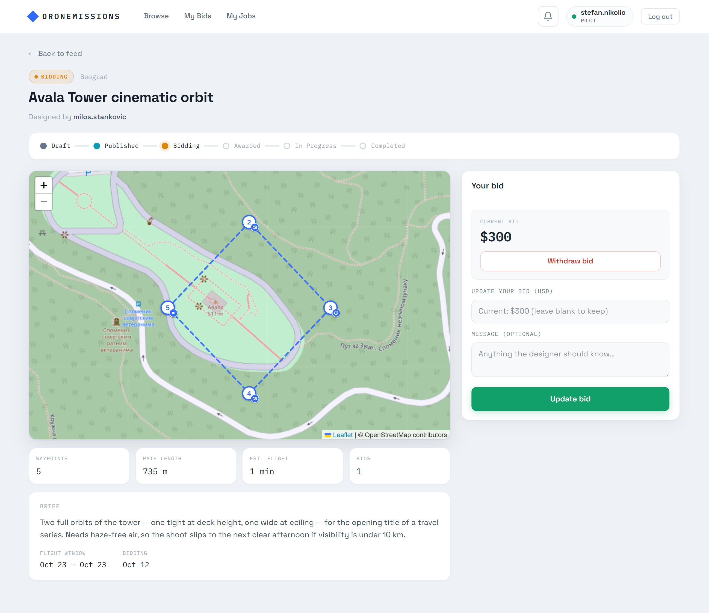
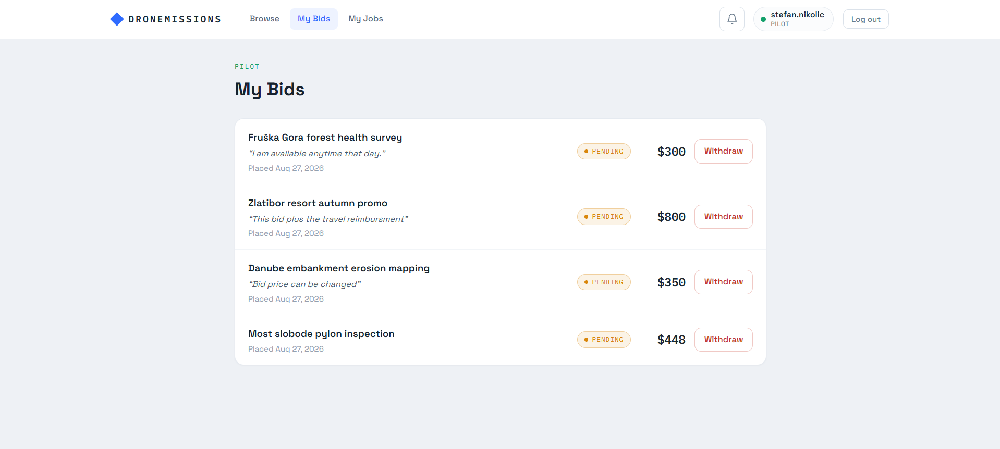
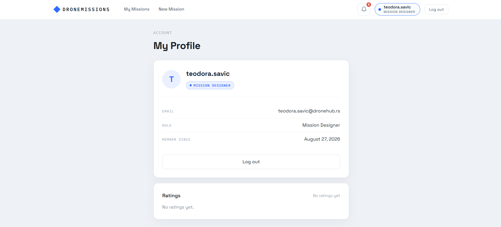
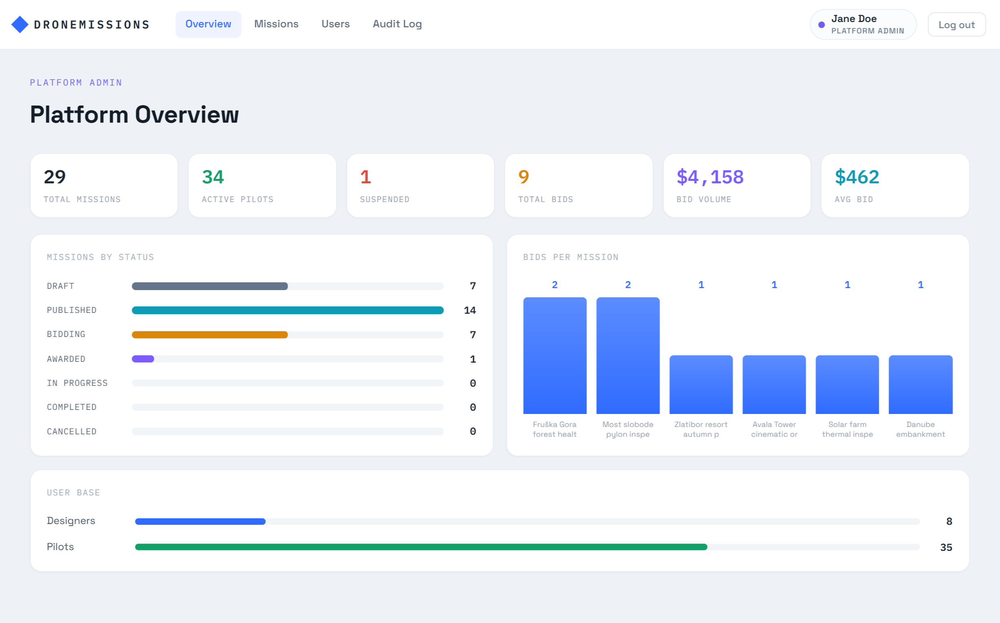

# DroneMissions — Frontend

An **Angular 19** single-page app for a drone-mission marketplace. *Mission designers* plan flight
missions on a map and publish them; *pilots* browse open work, bid on it, fly it and get rated; a
*platform admin* moderates missions and accounts and reviews an audit trail of everything that
happened.

The app is a pure front end — it talks to a Spring backend at `http://localhost:8085`. When the
backend is unreachable, every view degrades to an explicit loading / empty / error state rather
than breaking.



---

## Tech stack

| | |
|---|---|
| Framework | Angular 19.2, **standalone components** (no `NgModule`) |
| Language | TypeScript 5.7 in `strict` mode, Angular `strictTemplates` on |
| Async | RxJS 7.8 — services return cold observables, components subscribe |
| Maps | Leaflet 1.9 with OpenStreetMap raster tiles |
| Forms | Reactive Forms (`fb.nonNullable.group`) |
| Tests | Karma + Jasmine |
| Lint | ESLint 9 flat config via `angular-eslint` |

No UI component library and no state-management library — the app uses plain Angular plus a couple
of small `BehaviorSubject`-backed services.

---

## Getting started

**Prerequisites**

- Node.js (a version supported by Angular 19) and npm
- The Spring backend running on `http://localhost:8085`, configured to allow CORS from
  `http://localhost:4200`

**Run it**

```bash
npm install
npm start          # → http://localhost:4200
```

**Scripts**

| Command | What it does |
|---|---|
| `npm start` | `ng serve` — dev server on port 4200, no optimization, source maps |
| `npm run build` | `ng build` — production build into `dist/drone-missions-frontend` |
| `npm run watch` | `ng build --watch --configuration development` |
| `npm test` | `ng test` — Karma + Jasmine, launches Chrome |
| `npm run lint` | `ng lint` — TypeScript *and* template rules |

Run a single spec file with `ng test --include='**/foo.component.spec.ts'`.

---

## Roles

The role is chosen at registration and is permanent. It decides the navigation, the home route
after sign-in, and which routes the guards will let you reach.

| Role | What it does | Nav | Home after login |
|---|---|---|---|
| **Designer** | Plans and owns missions, reviews incoming bids, picks the winning pilot | My Missions · New Mission | `/missions/mine` |
| **Pilot** | Browses open missions, bids, flies the awarded job, gets notified | Browse · My Bids · bell | `/missions` |
| **Admin** | Moderates missions and accounts, reads platform stats and the audit log | Overview · Missions · Users · Audit Log | `/admin/overview` |

---

## Features

### Accounts and authentication

| | |
|---|---|
|  |  |

- **Register** with a username, email, password (minimum 8 characters) and a role picked from two
  cards — Designer or Pilot. A duplicate email comes back as *"That email is already registered."*
  On success you land on the sign-in page with a confirmation banner.
- **Sign in** with email and password. Wrong credentials produce *"Invalid email or password."*
- The JWT arrives in the **`Authorization` response header** of the login call and is stored in
  `localStorage` under the key `dm_token`.
- `authInterceptor` attaches `Authorization: Bearer <token>` to every request aimed at the backend
  host. On a `401` from anything other than an `/auth/*` call it logs you out and sends you to
  `/login`.
- The token payload is decoded client-side to read the user id, role and expiry — that drives the
  guards and the navigation. It is *convenience only*; the backend still validates every request.
- Route guards: `authGuard` (signed in), `designerGuard`, `pilotGuard`, `adminGuard`, and
  `landingGuard`, which bounces an already-signed-in visitor off the public landing page to their
  role's home.

### Mission lifecycle

Every mission moves through a fixed lifecycle, rendered as a timeline on the mission page:

```
DRAFT → PUBLISHED → BIDDING → AWARDED → IN_PROGRESS → COMPLETED
                                     ↘ CANCELLED (any time before completion)
```

| Status | How it is reached |
|---|---|
| `DRAFT` | Designer saves a mission without publishing it |
| `PUBLISHED` | Designer publishes — the mission appears in the pilot feed |
| `BIDDING` | The first pilot bid flips the mission automatically |
| `AWARDED` | Designer accepts one bid; the remaining bids are rejected |
| `IN_PROGRESS` | The winning pilot starts the mission |
| `COMPLETED` | The winning pilot marks it finished; ratings unlock |
| `CANCELLED` | Designer cancels, any time before completion |

Admin **moderation** is a separate axis from the lifecycle: a mission is `VISIBLE` or `HIDDEN`.
Hiding takes it out of the pilot feed and is reversible; an admin *remove* is a permanent delete,
not a state.

### Mission planner



One shared editor handles both creating and editing a mission. The left half is a Leaflet map
(defaulting to Belgrade), the right half is the brief.

**Flight path**

- Three map modes: **Add node**, **Move / edit**, **Pan**.
- Click the map to add a waypoint, drag a marker to move it, right-click a marker to remove it.
- **Undo** steps back one waypoint; **Clear** wipes the plan.
- Waypoints are numbered pins — the first is green, the rest blue, and any point outside the flight
  zone turns red.

**Waypoint settings** — adding or editing a node opens a modal that collects:

- **Altitude** in metres above ground (capped at 120 m)
- **Action**: Take a picture · Start recording · Stop recording · Hover
- **Hover duration** in whole seconds — only required for the Hover action

Each waypoint's action shows as a small glyph on its map marker, with a tooltip like
`Hover 30 s · 60 m`.

**Flight zone (geofence)** — choose **Circle**, **Polygon** or **None**. A circle gets a centre
handle plus a radius handle (minimum 50 m); a polygon gets a handle per vertex. You can convert
between the two shapes, and dragging a waypoint out of the zone snaps it back. Clicking outside the
zone in Add mode is refused with a brief warning instead of adding a stray node.

**Live telemetry** under the map updates as you draw: waypoint count, total path length, and an
estimated flight time (based on a 9 m/s cruise speed).

**The brief** — title (max 200 characters), location, description (max 2000), start and end date
(the end must not precede the start), and a bidding deadline.

**Saving** — *Save as draft* keeps it private; *Publish* pushes it to the pilot feed and requires a
title and at least two waypoints. Validation errors coming back from the backend are surfaced on
the matching field, including per-waypoint ones.

### Marketplace and designer dashboard



One list component serves two purposes:

- **Browse** (pilots) — the open-mission feed, with debounced **keyword**, **location** and **date**
  filters plus a Clear button. The active filters are mirrored into the URL, so a filtered feed is
  a shareable link and survives a refresh.
- **My Missions** (designers) — the designer's own missions, headed by Total / Draft / Published /
  Completed tiles and a *New Mission* call to action.

Every card shows a static Leaflet thumbnail of the flight plan, a status badge, the location, the
flight window, the path length, the designer's name with their star rating, and the created date.

### Mission detail

The mission page adapts to who is looking at it. Everyone sees the status timeline, a read-only map
of the flight plan, telemetry tiles (waypoints, path length, estimated flight time, bid count) and
the brief.

**The owning designer** additionally gets *Edit*, *Cancel mission* and *Delete*, plus the full list
of incoming bids with an **Accept** button on each.

**A pilot** gets the bidding panel instead. Once a pilot has won, the page turns into the job
controls: *Start mission*, then *Mark mission finished*.

### Bidding

| | |
|---|---|
|  |  |

- A pilot places **one bid per mission** — an amount plus an optional message to the designer.
- Re-submitting updates the existing bid. Leaving a field blank keeps its current value.
- **Withdraw** removes a pending bid.
- The first bid on a mission flips it from `PUBLISHED` to `BIDDING`.
- Bidding closes once the bidding deadline has passed (the deadline covers its whole day).
- The designer **accepts** one bid: the mission is awarded to that pilot and every other bid is
  rejected.
- **My Bids** lists a pilot's whole bid history — mission name, their message, amount, a
  Pending / Accepted / Rejected chip, and a Withdraw button on pending ones.

### Ratings and profiles



- Once a mission is `COMPLETED`, each side may rate the other **once**: 1–5 stars plus an optional
  comment of up to 500 characters. Ratings are final and cannot be edited — the form says so.
- Both ratings are shown side by side on the completed mission.
- A user's average and review list appear on their own profile (`/profile`) and on anyone else's
  public profile (`/users/:id`), reachable from a mission's rating panel. Averages also ride along
  on feed cards next to the designer's name.
- Public profiles deliberately omit the email address; only your own profile shows it.

### Notifications and toasts

- The nav **bell is shown to pilots**. It carries an unread badge and opens a dropdown of recent
  notifications with a *Mark all read* action.
- Notification types: **bid accepted**, **bid rejected**, and **mission overdue**.
- Clicking a notification marks it read and opens the related mission.
- The list is polled every 45 seconds while a pilot is signed in, and cleared on sign-out.
- **Toasts** are a separate, purely client-side mechanism: a single bottom-centre confirmation that
  auto-dismisses after ~2.8 s, used for actions like placing a bid, awarding a mission, starting or
  finishing one, saving a rating, and every admin action.

### Admin panel



**Overview** — the admin home. Stat tiles (total missions, active pilots, suspended accounts, total
bids, bid volume, average bid), a missions-by-status bar chart, a top-missions-by-bid-count column
chart, and the user base split by role.

**Missions** — every mission on the platform with server-side search and paging. An admin can
**hide** a mission (removing it from the pilot feed, reversible) or **remove** it permanently, each
behind a confirmation dialog. Rows whose designer is suspended are flagged, and hidden rows are
dimmed.

**Users** — every account, paged, filterable by role (All / Designers / Pilots / Admins), each with
an Active or Suspended chip. Admins can **suspend** and **reactivate** accounts — the confirmation
spells out the consequence for that specific role — and create another admin from the
*+ New Admin* screen.

**Audit Log** — a newest-first timeline of everything that happened, filterable by role, by action
and by free-text search, with paging. It covers 18 action types across missions (created, updated,
deleted, started, completed, cancelled, hidden, unhidden, removed, restored), bids (placed,
withdrawn, accepted), accounts (registered, logged in, suspended, reactivated) and ratings.

---

## Routes

Defined in `src/app/app.routes.ts`.

| Path | Component | Guards |
|---|---|---|
| `''` | `LandingComponent` | `landingGuard` |
| `login` | `LoginComponent` | — |
| `register` | `RegisterComponent` | — |
| `missions` | `MissionListComponent` | `authGuard` |
| `missions/mine` | `MissionListComponent` | `authGuard` (route data `{ mine: true }`) |
| `missions/new` | `MissionFormComponent` | `authGuard`, `designerGuard` |
| `missions/:id/edit` | `MissionFormComponent` | `authGuard`, `designerGuard` |
| `missions/:id` | `MissionDetailComponent` | `authGuard` |
| `my-bids` | `MyBidsComponent` | `authGuard`, `pilotGuard` |
| `admin/overview` | `AdminOverviewComponent` | `authGuard`, `adminGuard` |
| `admin/missions` | `AdminMissionsComponent` | `authGuard`, `adminGuard` |
| `admin/users` | `AdminUsersComponent` | `authGuard`, `adminGuard` |
| `admin/users/new` | `AdminRegisterComponent` | `authGuard`, `adminGuard` |
| `admin/audit-log` | `AdminAuditLogComponent` | `authGuard`, `adminGuard` |
| `profile` | `ProfileComponent` | `authGuard` |
| `users/:id` | `UserProfileComponent` | `authGuard` |
| `**` | redirect to `''` | — |

Order matters: the literal segments `missions/new`, `missions/mine` and `missions/:id/edit` must
stay above the parametric `missions/:id`, or `new` and `mine` get captured as ids.

Several views keep their state in query parameters, so filtered lists are deep-linkable: the feed
uses `?keyword&location&date`, the admin lists use `?page&q&role&action`, and the mission page
accepts `?from=my-bids` to send the back button to the right place.

---

## Backend API

Everything is rooted at `http://localhost:8085/api/v1`.

**Missions**

| Endpoint | Purpose |
|---|---|
| `GET /missions?location&keyword&date` | The open marketplace feed |
| `GET /missions/my-missions` | The designer's own missions |
| `GET /missions/my-jobs` | The pilot's awarded missions |
| `GET /missions/all?page&q` | Admin list, paged and searchable |
| `GET /missions/{id}` | One mission |
| `POST /missions` · `PUT /missions/{id}` · `DELETE /missions/{id}` | Create · update · delete |
| `POST /missions/{id}/start` · `/complete` · `/cancel` | Lifecycle transitions |
| `POST /missions/{id}/hide` · `/unhide` · `/remove` | Admin moderation |

**Auth and users**

| Endpoint | Purpose |
|---|---|
| `POST /auth/register` · `POST /auth/login` | Sign up · sign in (JWT in the response header) |
| `GET /users/me` · `GET /users/{id}` | Own profile · someone else's public profile |
| `GET /users?page&role` | Admin account list |
| `POST /users/{id}/suspend` · `/reactivate` | Admin account moderation |
| `POST /users/admins` | Create another admin |

**Bids**

| Endpoint | Purpose |
|---|---|
| `POST /bids/mission/{missionId}` | Place or update your bid |
| `GET /bids/mission/{missionId}` | Bids on a mission (owner sees all, a pilot only their own) |
| `GET /bids/my` | The pilot's bid history |
| `DELETE /bids/{bidId}` | Withdraw a pending bid |
| `POST /bids/{bidId}/accept` | Award the mission |

A `{bidId}` segment always identifies a bid; a mission is only ever reached through the explicit
`/mission/{missionId}` sub-path, so `/bids/5` is never ambiguous.

**Ratings, notifications, admin**

| Endpoint | Purpose |
|---|---|
| `POST /ratings/mission/{id}` | Rate the other side of a completed mission |
| `GET /ratings/mission/{id}` · `GET /ratings/user/{id}` | Ratings on a mission · a user's reputation |
| `GET /notifications` · `POST /notifications/{id}/read` · `POST /notifications/read-all` | In-app notifications |
| `GET /audit-log?page&role&action&q` | Admin audit trail |
| `GET /platform-stats` | Admin overview numbers |

Paginated endpoints return Spring Data's `PagedModel` envelope (`content[]` plus a `page` object
with a **0-based** `number`).

---

## Project structure

```
src/app/
├── app.config.ts            # bootstrap providers: router, HttpClient + authInterceptor
├── app.routes.ts            # the route table above
├── app.component.*          # shell: role-aware nav, account chip, toast outlet
├── components/
│   ├── landing/ login/ register/            # public entry points
│   ├── profile/ user-profile/               # own account · anyone's public profile
│   ├── mission-list/                        # marketplace feed + designer dashboard
│   ├── mission-detail/                      # role-aware mission page
│   ├── mission-form/                        # planner / editor
│   ├── mission-map/                         # Leaflet map (interactive + static thumbnail)
│   ├── waypoint-dialog/                     # altitude + action modal
│   ├── my-bids/ notification-bell/          # pilot bid history · nav bell
│   ├── rating-form/ rating-list/ rating-note/ rating-stars/
│   ├── admin-overview/ admin-missions/ admin-users/ admin-register/ admin-audit-log/
│   └── confirm-dialog/ toast/               # shared UI primitives
├── services/                # auth, mission, bid, rating, notification, user,
│                            # audit-log, platform-stats, toast, auth.interceptor
├── guards/auth.guard.ts     # authGuard, designerGuard, pilotGuard, adminGuard, landingGuard
├── models/                  # mission, bid, rating, notification, user, audit, stats, page
└── util/geo.ts              # haversine distance, path length, centroid, geofence helpers
```

Static assets live in `public/` and are served from the root.

---

## Conventions

- **Never surface raw IDs.** Database identifiers are for routes and API calls only. User-facing
  text uses names, usernames, emails and statuses — the backend resolves ids to names server-side
  (`designerName`, `pilotName`, `missionName`, `raterName`) precisely so the UI never has to.
- Standalone components only; dependencies go in the `@Component` `imports` array.
- Angular's built-in control flow (`@if` / `@for` / `@switch`), not the legacy structural directives.
- Services are `providedIn: 'root'`, use `inject()`, and return cold observables without
  subscribing or caching internally.
- Status and role enums are string-literal unions with companion label/colour constants — reuse
  those rather than hard-coding text or hex values in templates.
- Component selector prefix is `app`.
- Strict TypeScript: `noImplicitOverride`, `noPropertyAccessFromIndexSignature`,
  `noImplicitReturns`, `noFallthroughCasesInSwitch`.
- Production bundle budgets: 500 kB initial (warning) / 1 MB (error), and 4 kB / 8 kB per component
  stylesheet.

---

## Notes and known gaps

- `MissionService.getMyJobs()` (`GET /missions/my-jobs`) is implemented but not currently called
  from any component.
- Test coverage is thin: four spec files (`app.component`, `audit-log.service`,
  `platform-stats.service`, `user.service`). There is no e2e framework installed.
- The backend base URL is hard-coded in each service rather than living in `src/environments/`.
  Promoting it is the obvious next cleanup.
- There is no dev proxy — the backend must allow CORS from `http://localhost:4200`.
- `CLAUDE.md` predates the admin panel, ratings, audit log and waypoint actions, so treat the code
  as the source of truth where the two disagree.
